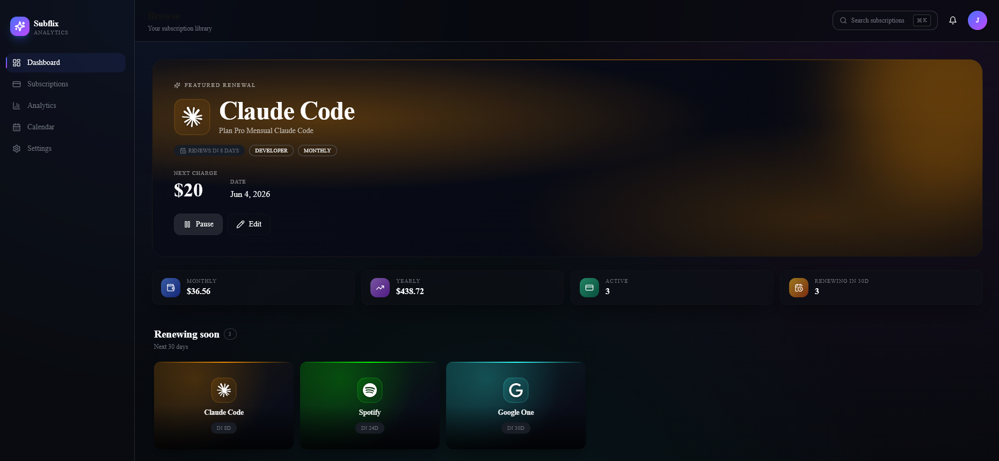
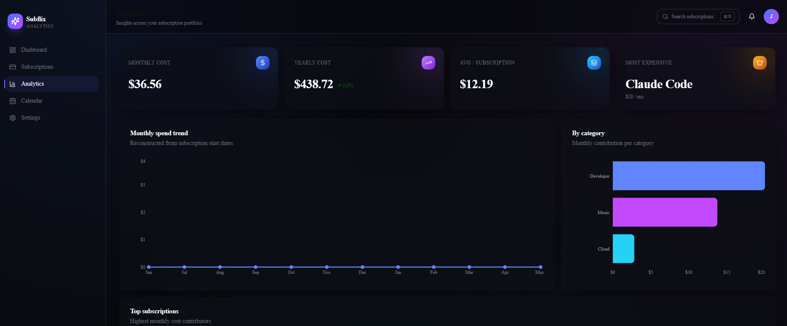
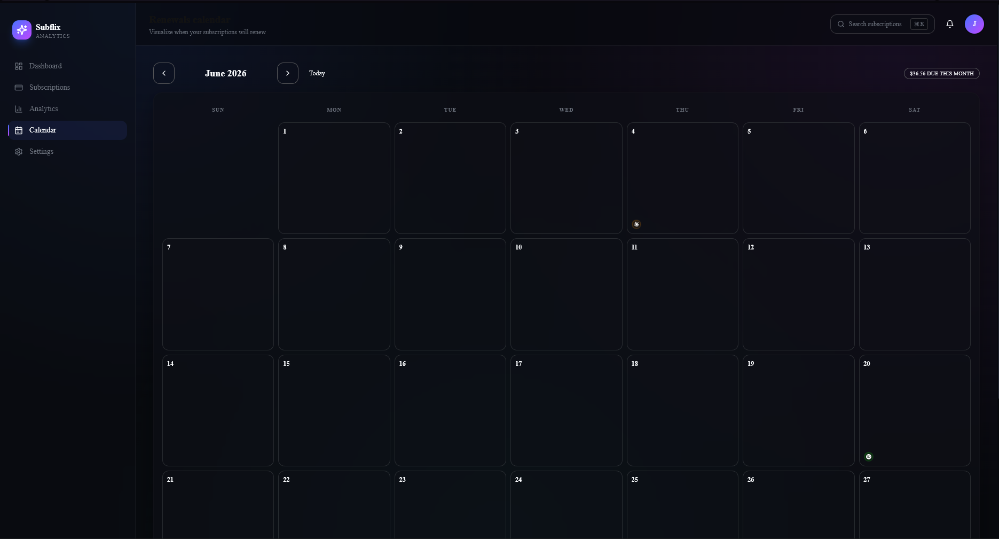

<div align="center">

# Subflix — Subscription Analytics Platform

**A premium SaaS dashboard to track, analyze and control your digital subscriptions.**

[](https://github.com/JuanMedinaRdz/subflix/actions/workflows/ci.yml)
[](https://subflix-seven.vercel.app)
[](https://nextjs.org)
[](https://www.typescriptlang.org)
[](https://supabase.com)
[](https://playwright.dev)

[**🔗 Live demo**](https://subflix-seven.vercel.app) · [**Source**](https://github.com/JuanMedinaRdz/subflix) · [**Bug report**](https://github.com/JuanMedinaRdz/subflix/issues)

</div>



<table>
  <tr>
    <td align="center"><a href="./docs/analytics_subflix.png"></a><br/><sub><b>Analytics</b></sub></td>
    <td align="center"><a href="./docs/calendar_subflix.png"></a><br/><sub><b>Renewals calendar</b></sub></td>
  </tr>
</table>

---

## Why this project

Subflix is a portfolio piece that ships as a **real, deployed, multi-device product**, not a tutorial app. It demonstrates:

- 🎨 **Modern frontend craftsmanship** — Netflix-inspired UI, dark mode, glassmorphism, Framer Motion, responsive layouts.
- 🔐 **Production authentication** — Supabase magic-link auth + Row Level Security so each user only sees their own data.
- 🧪 **Professional QA automation** — 38 Playwright e2e tests with Page Object Model running in CI on every push.
- ⚙️ **End-to-end DevOps** — GitHub Actions pipeline, automatic Vercel deploys, environment-aware configuration.
- 🏛 **Clean architecture** — clear separation between UI, domain logic, hooks and persistence layers; strict TypeScript everywhere.

Try the [**live demo**](https://subflix-seven.vercel.app) — no signup needed to browse. Sign in with your email to sync subscriptions across devices.

---

## Tech stack

| Layer            | Tools                                                                 |
| ---------------- | --------------------------------------------------------------------- |
| Framework        | Next.js 15 (App Router), React 18, TypeScript (strict mode)           |
| Styling          | TailwindCSS 3, custom design tokens, glassmorphism utilities          |
| UI primitives    | Radix UI (Dialog, Dropdown, Select, Label), shadcn-style composition  |
| Animation        | Framer Motion (hero entry, tile hover-expand, page transitions)       |
| Charts           | Recharts (area, line, bar, donut)                                     |
| Icons / logos    | lucide-react + Simple Icons CDN (brand logos)                         |
| Auth + DB        | Supabase Auth (magic link) + Postgres + Row Level Security            |
| SSR auth         | `@supabase/ssr` browser/server/middleware clients                     |
| Testing          | Playwright (Chromium desktop + Pixel 7 mobile), Page Object Model     |
| CI / CD          | GitHub Actions (typecheck → build → e2e), Vercel auto-deploy on push  |

---

## Engineering highlights

A few decisions worth calling out for anyone reviewing the code:

### Dual-mode persistence — zero-friction demo, real sync when signed in
The `useSubscriptions` hook detects whether the user is authenticated and seamlessly swaps the data source:
- **Anonymous visitor** → reads/writes `localStorage`, sees the 14 seed subscriptions. Perfect for recruiters landing on the demo with zero friction.
- **Signed-in user** → reads/writes Supabase with RLS, syncs across devices.

A single hook, same API for callers. See [`src/hooks/use-subscriptions.ts`](src/hooks/use-subscriptions.ts).

### Resilient configuration
Supabase env vars are validated for shape (URL must be a valid `https://` URL, key must be non-trivial) and **every** `createClient` call is wrapped in try/catch. If env vars are missing or malformed in production, the app silently degrades to demo mode instead of crashing the build during static prerender. See [`src/lib/supabase/config.ts`](src/lib/supabase/config.ts).

### Auto-seed via Postgres trigger
New users don't get an empty dashboard. A `BEFORE INSERT` trigger on `auth.users` seeds each new account with the 14 demo subscriptions, so onboarding is instant. See [`SUPABASE_SETUP.md`](SUPABASE_SETUP.md).

### Pure domain logic
Computations like `totalMonthly`, `byCategory`, `monthlyTrend`, `upcomingRenewals` live in [`src/lib/subscriptions.ts`](src/lib/subscriptions.ts) — pure functions, no React, easily unit-testable.

### Test-stable selectors from day one
Every interactive element exposes a `data-testid` (`metric-monthly`, `subscription-card`, `topbar-signin`, etc.) so the e2e suite never depends on text strings or class names that can drift with copy changes.

---

## Project structure

```
src/
├─ app/                          # Next.js App Router
│  ├─ page.tsx                   # Netflix-style dashboard
│  ├─ subscriptions/             # CRUD grid
│  ├─ analytics/                 # Recharts views
│  ├─ calendar/                  # Monthly renewals view
│  ├─ login/                     # Magic-link sign-in
│  ├─ auth/callback/route.ts     # OAuth code → session exchange
│  ├─ settings/
│  └─ layout.tsx                 # Wraps app with AuthProvider
├─ components/
│  ├─ ui/                        # Base primitives (Button, Card, Dialog, …)
│  ├─ layout/                    # AppShell, Sidebar, Topbar, UserMenu
│  ├─ dashboard/                 # FeaturedRenewal, SubscriptionRow, MetricCard, …
│  └─ subscriptions/             # SubscriptionTile (hover-expand), Form, Card
├─ hooks/
│  ├─ use-auth.tsx               # AuthProvider context + useAuth()
│  └─ use-subscriptions.ts       # Dual-mode CRUD (Supabase | localStorage)
├─ lib/
│  ├─ supabase/                  # Browser, server, middleware clients + mappers
│  ├─ subscriptions.ts           # Pure domain functions
│  ├─ mock-data.ts               # Seed portfolio
│  └─ utils.ts                   # cn(), formatCurrency, daysUntil, …
├─ types/
└─ middleware.ts                 # Refreshes Supabase session cookie per request

tests/
├─ e2e/                          # 21 specs across smoke, nav, CRUD, login, responsive
└─ pages/                        # Page Object Model

.github/workflows/ci.yml         # typecheck → build → Playwright → upload report
playwright.config.ts             # CI-aware retries, screenshots, video, mobile project
```

---

## Getting started

```bash
# 1. Install
npm install

# 2. (Optional) Add Supabase env vars for real auth
cp .env.example .env.local
# fill NEXT_PUBLIC_SUPABASE_URL + NEXT_PUBLIC_SUPABASE_ANON_KEY

# 3. Run the dev server
npm run dev
# → http://localhost:3000
```

Without `.env.local` the app runs in **demo mode** (localStorage). With Supabase configured, the **Sign in** button enables the magic-link flow.

For the full Supabase setup (SQL migration, redirect URLs, env vars), see [SUPABASE_SETUP.md](SUPABASE_SETUP.md).
For deployment to Vercel, see [DEPLOY.md](DEPLOY.md).

### Scripts

```bash
npm run dev               # Next.js dev server
npm run build             # Production build
npm run start             # Run production build
npm run typecheck         # TypeScript strict check
npm run lint              # Next.js ESLint

npm run test:e2e          # All Playwright tests headless
npm run test:e2e:ui       # Interactive Playwright UI mode
npm run test:e2e:headed   # See the browsers in action
npm run test:e2e:report   # Open last HTML report
```

---

## Features in detail

### Dashboard (Netflix-style browse)
- Featured hero with the next renewal — big, branded, with quick Pause/Edit actions.
- Compact metric strip: monthly, yearly, active count, renewing in 30 days.
- Horizontal scrollable rows ("Renewing soon", "Top spend", "Recently added") + one row per category.
- Tiles scale and reveal a price/date overlay on hover, just like a streaming poster.
- Overdue alert banner when any subscription has missed its renewal date.

### Subscriptions
- Responsive grid of premium cards with brand-color top accent and status badges.
- Live search + category filter.
- Create/edit dialog covering all fields: name, description, price, cycle, category, next renewal, color, logo slug.
- Pause/resume and delete from the card menu.
- "Reset demo" restores the seed portfolio.

### Analytics
- Line chart of monthly spend trend with year-over-year delta.
- Horizontal bar chart of spend by category.
- Vertical bar chart of top expensive services using brand colors.
- KPIs: monthly, yearly, average per subscription, most expensive.

### Renewals calendar
- Month view with each renewal's logo on its day.
- Today highlighted with a glow ring; past days dim.
- Pulse dot for overdue renewals.
- Month total in the header.

### Authentication
- Magic-link sign-in (no passwords).
- Session persisted via httpOnly cookies + middleware-driven refresh.
- Row Level Security policies on every CRUD path.
- Auto-seed on signup so new users land on a populated dashboard.

---

## QA Automation

Subflix ships with a Playwright e2e suite — **21 specs, ~38 tests** across Chromium desktop and Pixel 7 mobile — running on every push via GitHub Actions.

```
tests/e2e/
├─ smoke.spec.ts          every public route boots without runtime errors
├─ navigation.spec.ts     sidebar walks all sections
├─ dashboard.spec.ts      metrics, hero, tile rows
├─ subscriptions.spec.ts  CRUD + search + persistence across reload
├─ login.spec.ts          form UI + disabled-when-unconfigured state
└─ responsive.spec.ts     mobile vs desktop layout

tests/pages/              Page Object Model
├─ BasePage.ts
├─ DashboardPage.ts
├─ SubscriptionsPage.ts
├─ LoginPage.ts
└─ CalendarPage.ts
```

Highlights:

- **Page Object Model** with a shared `BasePage` for layout locators.
- **`data-testid` selectors** throughout — tests don't break when copy changes.
- **Auto-managed web server** — `playwright.config.ts` boots `npm run dev` locally and `npm run start` in CI; no manual coordination.
- **CI tuning** — 2 retries, 2 workers, screenshots + video on failure, HTML + JSON + GitHub annotations reporters.
- **Mobile coverage** via the `Pixel 7` device profile.
- **Hermetic** — tests run in demo mode (no Supabase credentials needed in CI).

---

## CI / CD

[`.github/workflows/ci.yml`](.github/workflows/ci.yml) runs on every push to `main` and on every PR:

1. **`quality` job** — `npm ci` → `typecheck` → `build`, uploads the `.next` artifact.
2. **`e2e` job** — downloads the build, restores cached Playwright browsers (per-version cache), runs the suite, uploads the HTML report as an artifact with 14-day retention.

Pushing to `main` also triggers an automatic Vercel deploy — green build → green deploy in a few minutes.

---

## Roadmap

| Status | Phase | Scope |
| ------ | ----- | ----- |
| ✅ | 1 | Visual MVP — Netflix-style dashboard, CRUD, analytics, calendar, localStorage |
| ✅ | 2 | Supabase Auth (magic link) + protected session via middleware |
| ✅ | 3 | Supabase Postgres + Row Level Security + auto-seed trigger |
| ✅ | 4 | Playwright e2e suite with Page Object Model |
| ✅ | 5 | GitHub Actions: typecheck → build → e2e → report |
| ⏳ | 6 | Email notifications when a subscription is about to renew |
| ⏳ | 7 | CSV import/export, multi-currency support, command palette |
| ⏳ | 8 | i18n (en/es), accessibility audit, in-app testing dashboard |

---

## Credits

- Brand logos from [Simple Icons](https://simpleicons.org) via `cdn.simpleicons.org`.
- Design inspiration: Linear, Vercel, Stripe, Netflix, Notion.
- Auth flows and SSR cookies built on [`@supabase/ssr`](https://supabase.com/docs/guides/auth/server-side/nextjs).

---

<div align="center">

Built by [**Juan Carlos Medina**](https://github.com/JuanMedinaRdz) · [Live demo →](https://subflix-seven.vercel.app)

</div>
